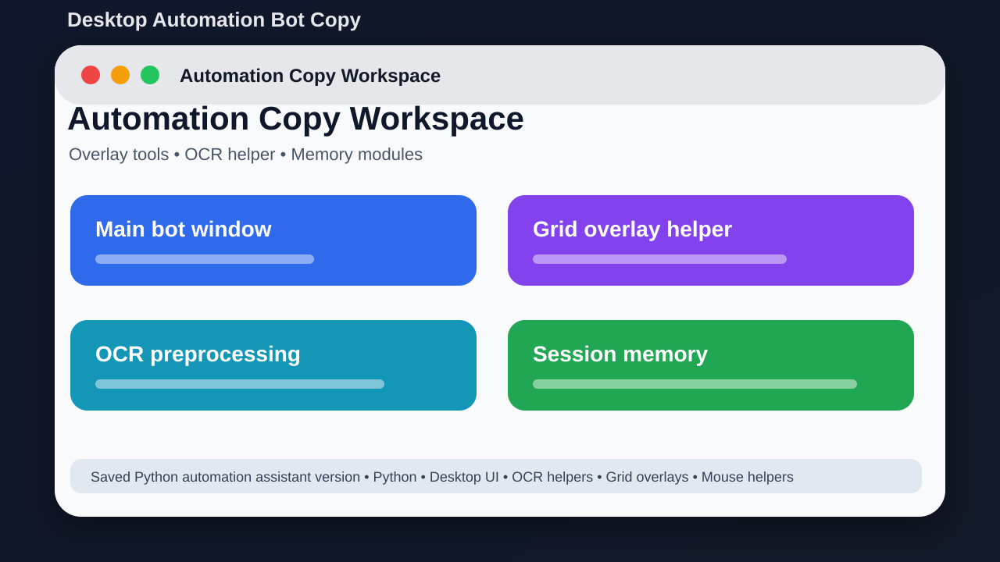

# Desktop Automation Bot Copy



## Short Description

A separate saved version of the desktop automation assistant for comparison and continued work.

## About This Project

Desktop Automation Bot Copy is another saved version of the Python desktop assistant. The runnable source is inside the omg folder. It includes UI panels, screenshots, OCR helpers, overlays, memory, prompts, and mouse actions.

The goal is to keep the project easy to understand, easy to run, and useful for learning or further development.

## Main Features

- Runnable source inside omg
- Desktop bot interface
- Screenshot and OCR helper modules
- Grid/overlay support
- Agent memory and prompt handling
- Mouse action helper code

## Tech Stack

- Python
- Desktop UI
- OCR helpers
- Grid overlays
- Mouse helpers

## Project Location

Main local folder:

```text
D:\PROJECTS\DesktopAutomationBot_Copy\omg
```

GitHub repository:

https://github.com/saifalian/DesktopAutomationBot_Copy

## Project Structure

```text
omg/
omg/actions/   Mouse action helpers
omg/agent/     Bot brain and memory files
omg/ui/        Interface files
omg/vision/    Screenshot and OCR helpers
omg/main.py    App entry point
```

## How To Run

1. Open a terminal inside omg.
2. Create and activate a Python virtual environment.
3. Install requirements.txt.
4. Run python main.py.

## Screenshot

The image above is a clean project preview for GitHub. It shows the main idea of the project in a simple way.

## Current Status

This project is uploaded to GitHub and prepared as a portfolio-style repository. More improvements can be added later, such as real app screenshots, demo videos, releases, and issue templates.

## Safety Note

Use this copy for testing and comparison before moving changes into the main project.

## License

No license file is included yet. Add a license before using this project as an open-source project.
